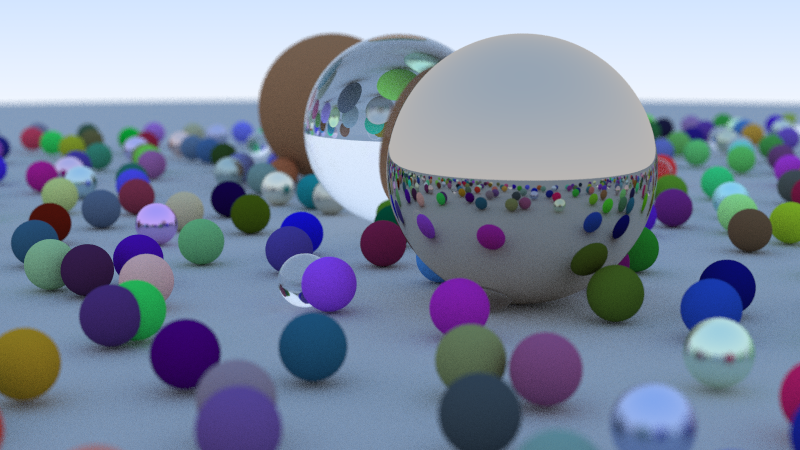
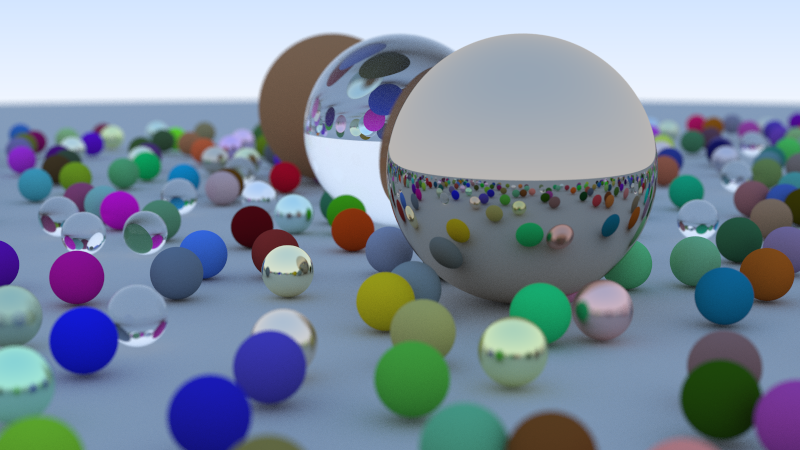

# Simple raytracer 

single file implementation of ["Raytracer in a weekend"](https://raytracing.github.io/books/RayTracingInOneWeekend.html) in cpp (mostly written in c style). I am not the biggest fan of object orignted programming hence implemented in simple c. 

## Compilation 

```
g++ main.cc -o [output-file]
```

## Results 

Renders which i was able to create 



